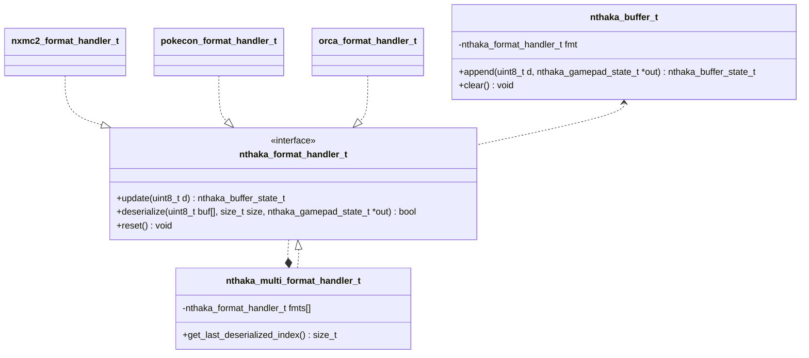

# Nthaka

Meta firmware for NX automation.

## Overview

With the Nintendo Switch (codename: NX) now equipped with the widely-used USB interface, several automated operation solutions using MCUs have come to light. The prevalent method currently involves two wiring paths: PC->MCU->NX and NX->HDMI Video Capture->PC. Through these paths, video feedback is obtained and processed on the PC side, after which operations are transmitted accordingly.

This library primarily focuses on the MCU aspect mentioned above. Regardless of the microcontroller or protocol used, its firmware will be abstracted to: receive byte arrays through communication, convert them into a data structure representing the next state of the gamepad, and reflect this to the NX.

## Usage

By implementing `nthaka_format_handler_t`, a specific communication format is defined. Implementations for [NX Macro Controller v2](https://blog.bzl-web.com/entry/2020/01/20/165719), [Poke-Controller Modified](https://github.com/Moi-poke/Poke-Controller-Modified) and [Orca-GC-Controller](https://github.com/yatsuna827/Orca-GC-Controller) are included as examples.

Below is a conceptual class diagram.



## Development Notes

Due to the presence of a symbolic link in the [example](example/) project, cloning this repository on Windows requires [specific permissions](https://github.com/git-for-windows/git/wiki/Symbolic-Links). I recommend using tools like `gsudo` as demonstrated below:

```
> sudo git clone -c core.symlink=true https://github.com/U-1F992/nthaka.git
```