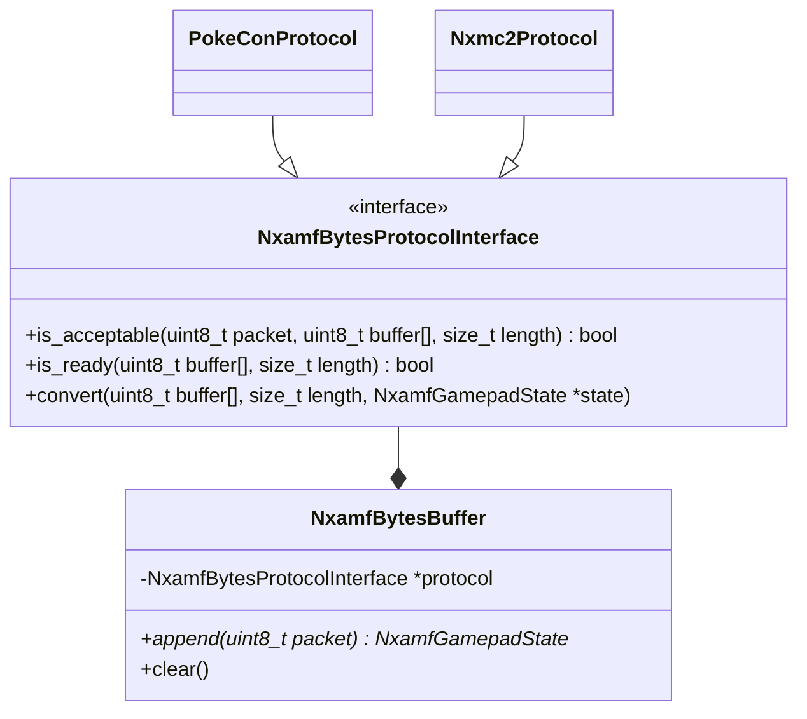

# NX Automation Meta Firmware Library

Meta firmware for NX automation.

## Overview

With the inclusion of USB in the Nintendo Switch (codename: NX), several automated operation solutions using MCU have emerged. Currently, sophisticated methods have become common where, through two wiring paths: `PC->MCU->NX` and `NX->HDMI Video Capture->PC`, video feedback is received and calculations are performed on the PC side to transmit operations.

This library primarily focuses on the MCU aspect mentioned above. Regardless of the microcontroller or protocol used, its firmware would be abstracted to "receive byte arrays through communication, convert it into a data structure representing the next state of the gamepad, and reflect it to the NX."

What this library offers is only an interface to represent the communication protocol, a structure to represent the state of the gamepad, and a buffer structure to accept/reject each packet according to the given protocol and extract the state. Users must combine these to define a specific communication protocol and create functions to reflect the extracted state to the NX.

## Concept

By implementing each method of NxamfBytesProtocolInterface, a specific communication protocol is defined. Implementations for the NX Macro Controller and Poke-Controller Modified are included as examples.

NxamfBytesBuffer holds the protocol as a member and provides an append for uint8_t. The determination of accept/reject is done by the protocol, and when ready, you get a pointer to NxamfGamepadState (please note that the state must be freed using delete). You can explicitly reset the buffer using the clear method.

Below is a conceptual class diagram in a Java-like notation.

## Dependency

- [kokke/tiny-regex-c](https://github.com/kokke/tiny-regex-c) included (public domain).
