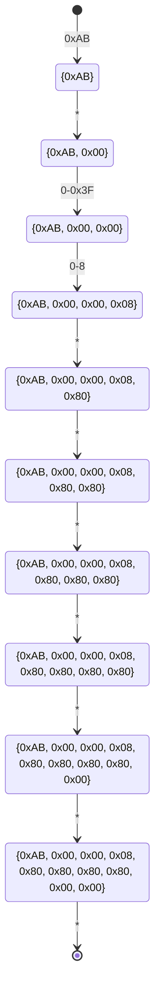

# NXMC2

- [【Nintendo Switch 自動化】画像認識マクロツール NX Macro Controllerの使い方](https://blog.bzl-web.com/entry/2020/01/20/165719)
- [Nintendo Switchを操作するプログラムの仕様を調べる](https://scrapbox.io/yatsuna827827-12010999/Nintendo_Switch%E3%82%92%E6%93%8D%E4%BD%9C%E3%81%99%E3%82%8B%E3%83%97%E3%83%AD%E3%82%B0%E3%83%A9%E3%83%A0%E3%81%AE%E4%BB%95%E6%A7%98%E3%82%92%E8%AA%BF%E3%81%B9%E3%82%8B)

