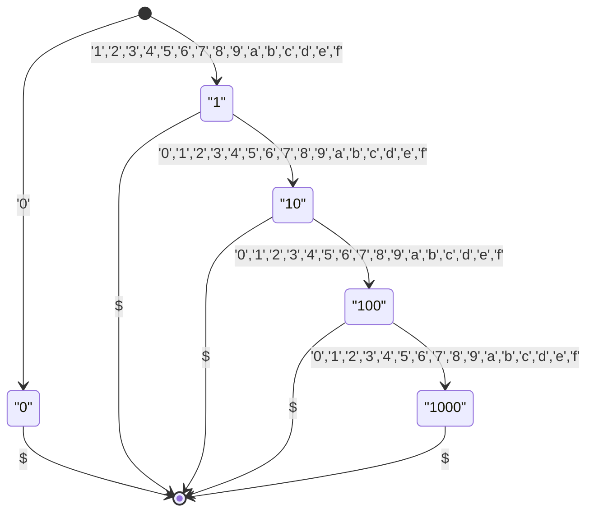
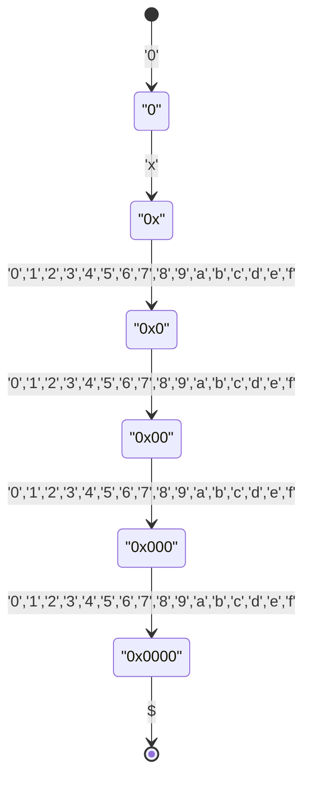
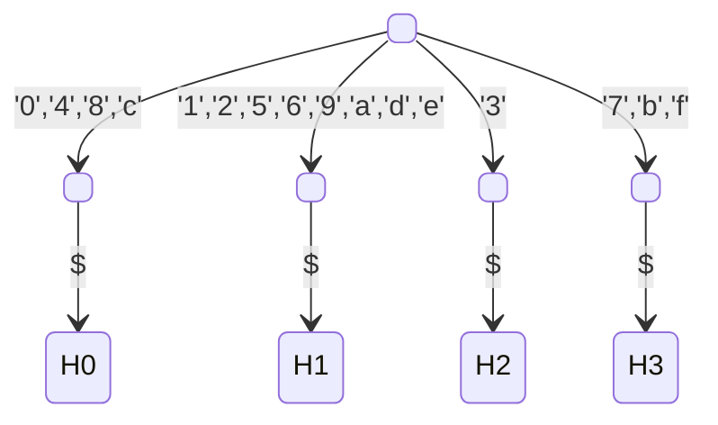
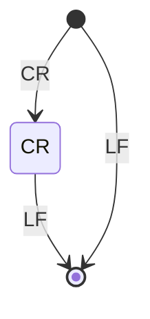

# PokeCon

- [Moi-poke/Poke-Controller-Modified](https://github.com/Moi-poke/Poke-Controller-Modified)

---

`"<buttons> <hat> [lx ly] [rx ry]"`の**文字列**で通信を行う。Pythonコマンドの終了時に`"end"`を送信する。

<details>
<summary>Log</summary>
<details>
<summary>Python</summary>

```python
from Commands.Keys import Button, Direction, Hat
from Commands.PythonCommandBase import PythonCommand


class TestSerial(PythonCommand):
    NAME = "TestSerial"

    def __init__(self):
        super().__init__()

    def do(self):
        self.wait(1)

        self.press(Button.Y, duration=0.5, wait=0.5)
        self.press(Button.B, duration=0.5, wait=0.5)
        self.press(Button.A, duration=0.5, wait=0.5)
        self.press(Button.X, duration=0.5, wait=0.5)
        self.press(Button.L, duration=0.5, wait=0.5)
        self.press(Button.R, duration=0.5, wait=0.5)
        self.press(Button.ZL, duration=0.5, wait=0.5)
        self.press(Button.ZR, duration=0.5, wait=0.5)
        self.press(Button.MINUS, duration=0.5, wait=0.5)
        self.press(Button.PLUS, duration=0.5, wait=0.5)
        self.press(Button.LCLICK, duration=0.5, wait=0.5)
        self.press(Button.RCLICK, duration=0.5, wait=0.5)
        self.press(Button.HOME, duration=0.5, wait=0.5)
        self.press(Button.CAPTURE, duration=0.5, wait=0.5)

        self.press(Hat.TOP, duration=0.5, wait=0.5)
        self.press(Hat.TOP_RIGHT, duration=0.5, wait=0.5)
        self.press(Hat.RIGHT, duration=0.5, wait=0.5)
        self.press(Hat.BTM_RIGHT, duration=0.5, wait=0.5)
        self.press(Hat.BTM, duration=0.5, wait=0.5)
        self.press(Hat.BTM_LEFT, duration=0.5, wait=0.5)
        self.press(Hat.LEFT, duration=0.5, wait=0.5)
        self.press(Hat.TOP_LEFT, duration=0.5, wait=0.5)

        self.press(Direction.UP, duration=0.5, wait=0.5)
        self.press(Direction.UP_RIGHT, duration=0.5, wait=0.5)
        self.press(Direction.RIGHT, duration=0.5, wait=0.5)
        self.press(Direction.DOWN_RIGHT, duration=0.5, wait=0.5)
        self.press(Direction.DOWN, duration=0.5, wait=0.5)
        self.press(Direction.DOWN_LEFT, duration=0.5, wait=0.5)
        self.press(Direction.LEFT, duration=0.5, wait=0.5)
        self.press(Direction.UP_LEFT, duration=0.5, wait=0.5)

        self.press(Direction.R_UP, duration=0.5, wait=0.5)
        self.press(Direction.R_UP_RIGHT, duration=0.5, wait=0.5)
        self.press(Direction.R_RIGHT, duration=0.5, wait=0.5)
        self.press(Direction.R_DOWN_RIGHT, duration=0.5, wait=0.5)
        self.press(Direction.R_DOWN, duration=0.5, wait=0.5)
        self.press(Direction.R_DOWN_LEFT, duration=0.5, wait=0.5)
        self.press(Direction.R_LEFT, duration=0.5, wait=0.5)
        self.press(Direction.R_UP_LEFT, duration=0.5, wait=0.5)

        self.wait(1)
```

```
0x0004 8
0x0000 8
0x0008 8
0x0000 8
0x0010 8
0x0000 8
0x0020 8
0x0000 8
0x0040 8
0x0000 8
0x0080 8
0x0000 8
0x0100 8
0x0000 8
0x0200 8
0x0000 8
0x0400 8
0x0000 8
0x0800 8
0x0000 8
0x1000 8
0x0000 8
0x2000 8
0x0000 8
0x4000 8
0x0000 8
0x8000 8
0x0000 8
0x0000 0
0x0000 8
0x0000 1
0x0000 8
0x0000 2
0x0000 8
0x0000 3
0x0000 8
0x0000 4
0x0000 8
0x0000 5
0x0000 8
0x0000 6
0x0000 8
0x0000 7
0x0000 8
0x0002 8 80 0
0x0002 8 80 80
0x0002 8 da 26
0x0002 8 80 80
0x0002 8 ff 80
0x0002 8 80 80
0x0002 8 da da
0x0002 8 80 80
0x0002 8 80 ff
0x0002 8 80 80
0x0002 8 26 da
0x0002 8 80 80
0x0002 8 0 80
0x0002 8 80 80
0x0002 8 26 26
0x0002 8 80 80
0x0001 8 80 0
0x0001 8 80 80
0x0001 8 da 26
0x0001 8 80 80
0x0001 8 ff 80
0x0001 8 80 80
0x0001 8 da da
0x0001 8 80 80
0x0001 8 80 ff
0x0001 8 80 80
0x0001 8 26 da
0x0001 8 80 80
0x0001 8 0 80
0x0001 8 80 80
0x0001 8 26 26
0x0001 8 80 80
end
```

</details>
<details>
<summary>Use Keyboard</summary>

```
0x0004 8
0x0000 8
0x0008 8
0x0000 8
0x0010 8
0x0000 8
0x0020 8
0x0000 8
0x0040 8
0x0000 8
0x0080 8
0x0000 8
0x0100 8
0x0000 8
0x0200 8
0x0000 8
0x0400 8
0x0000 8
0x0800 8
0x0000 8
0x1000 8
0x0000 8
0x2000 8
0x0000 8
0x4000 8
0x0000 8
0x8000 8
0x0000 8
0x0002 8 80 0
0x0002 8 80 80
0x0002 8 ff 80
0x0002 8 80 80
0x0002 8 80 ff
0x0002 8 80 80
0x0002 8 0 80
0x0002 8 80 80
```

</details>
<details>
<summary>Controller</summary>

```
0x0004 8
0x0000 8
0x0008 8
0x0000 8
0x0010 8
0x0000 8
0x0020 8
0x0000 8
0x0040 8
0x0000 8
0x0080 8
0x0000 8
0x0100 8
0x0000 8
0x0200 8
0x0000 8
0x0400 8
0x0000 8
0x0800 8
0x0000 8
0x1000 8
0x0000 8
0x2000 8
0x0000 8
0x4000 8
0x0000 8
0x8000 8
0x0000 8
```

</details>
<details>
<summary>Use LStick Mouse</summary>

```
3 8 0x80 0x7d 80 80
3 8 0x80 0x68 80 80
3 8 0x80 0x57 80 80
3 8 0x80 0x35 80 80
3 8 0x86 0x1e 80 80
3 8 0x8c 0x15 80 80
3 8 0xa0 0x4 80 80
3 8 0xae 0x9 80 80
3 8 0xc9 0x17 80 80
3 8 0xda 0x26 80 80
3 8 0xfc 0x64 80 80
3 8 0xff 0x86 80 80
3 8 0xfb 0x9f 80 80
3 8 0xe9 0xc7 80 80
3 8 0xb9 0xf1 80 80
3 8 0x8f 0xfe 80 80
3 8 0x67 0xfd 80 80
3 8 0x44 0xf0 80 80
3 8 0x24 0xd9 80 80
3 8 0x5 0xa2 80 80
3 8 0x3 0x62 80 80
3 8 0x10 0x41 80 80
3 8 0x3d 0x13 80 80
3 8 0x5a 0x6 80 80
3 8 0x6b 0x2 80 80
3 8 0x75 0x0 80 80
3 8 0x7c 0x0 80 80
3 8 0x7e 0x0 80 80
3 8 0x83 0x0 80 80
3 8 0x85 0x0 80 80
3 8 0x87 0x0 80 80
3 8 80 80
```

</details>
<details>
<summary>Use RStick Mouse</summary>

```
3 8 80 80 0x80 0x6f
3 8 80 80 0x82 0x68
3 8 80 80 0x82 0x60
3 8 80 80 0x82 0x57
3 8 80 80 0x82 0x4a
3 8 80 80 0x8a 0x39
3 8 80 80 0x93 0x2f
3 8 80 80 0x9d 0x24
3 8 80 80 0xac 0x1c
3 8 80 80 0xd9 0x2f
3 8 80 80 0xf4 0x55
3 8 80 80 0xff 0x79
3 8 80 80 0xf2 0xb8
3 8 80 80 0xde 0xd5
3 8 80 80 0xb9 0xf2
3 8 80 80 0x81 0xff
3 8 80 80 0x4c 0xf4
3 8 80 80 0x1f 0xd3
3 8 80 80 0xb 0xb3
3 8 80 80 0x7 0xa9
3 8 80 80 0x2 0x96
3 8 80 80 0x1 0x6d
3 8 80 80 0xd 0x48
3 8 80 80 0x17 0x37
3 8 80 80 0x1e 0x2e
3 8 80 80 0x24 0x27
3 8 80 80 0x31 0x1b
3 8 80 80 0x3b 0x14
3 8 80 80 0x42 0x10
3 8 80 80 0x48 0xd
3 8 80 80 0x4d 0xa
3 8 80 80 0x5a 0x6
3 8 80 80 0x61 0x4
3 8 80 80 0x63 0x3
3 8 80 80 0x66 0x3
3 8 80 80 0x6a 0x2
3 8 80 80 0x6f 0x1
3 8 80 80 0x76 0x0
3 8 80 80 0x78 0x0
3 8 80 80 80 80
```

</details>
</details>
<dl>
<dt>buttons</dt>
<dd>

16ビットのビットフィールドを`"0"`-`"ffff"`（接頭辞およびゼロパディングなし）または`"0x0000"`-`"0xffff"`（接頭辞およびゼロパディングあり）で表す。

|   D15   |  D14  |  D13   |  D12   |  D11  |  D10  |  D9   |  D8   |  D7   |  D6   |  D5   |  D4   |  D3   |  D2   |       D1       | D0             |
| :-----: | :---: | :----: | :----: | :---: | :---: | :---: | :---: | :---: | :---: | :---: | :---: | :---: | :---: | :------------: | -------------- |
| CAPTURE | HOME  | RCLICK | LCLICK | PLUS  | MINUS |  ZR   |  ZL   |   R   |   L   |   X   |   A   |   B   |   Y   | L_STICK_UPDATE | R_STICK_UPDATE |

</dd>
<dt>hat</dt>
<dd>

`'0'`-`'8'`で表す。

| Direction | Value |
| :-------: | :---: |
|    TOP    | `'0'` |
| TOP_RIGHT | `'1'` |
|   RIGHT   | `'2'` |
| BTM_RIGHT | `'3'` |
|    BTM    | `'4'` |
| BTM_LEFT  | `'5'` |
|   LEFT    | `'6'` |
| TOP_LEFT  | `'7'` |
|  NEUTRAL  | `'8'` |

</dd>
<dt>lx ly</dt>
<dd>

L_STICK_UPDATEが1の場合のみ、左スティックの(x, y)をそれぞれ`"0"`-`"ff"`（接頭辞およびゼロパディングなし）または`"0x0"`-`"0xff"`（接頭辞ありゼロパディングなし）で表す。左上が(0, 0)、右下が(255, 255)。

</dd>
<dt>rx ry</dt>
<dd>

R_STICK_UPDATEが1の場合のみ、右スティックの(x, y)をそれぞれ`"0"`-`"ff"`（接頭辞およびゼロパディングなし）または`"0x0"`-`"0xff"`（接頭辞ありゼロパディングなし）で表す。左上が(0, 0)、右下が(255, 255)。
  
Use LStick Mouseを有効にして画面クリックで発生させたスティック入力を離す際、L_STICK_UPDATE==1&&L_STICK_UPDATE==1にも関わらずrx ryが送信されないバグがある。

</dd>
</dl>

## buttons

<details>
<summary><code>"0"</code>-<code>"ffff"</code>（基本形）</summary>



</details>
<details>
<summary><code>"0x0000"</code>-<code>"0xffff"</code>（基本形）</summary>



</details>
<details>
<summary>末尾は下位2ビットで分岐する</summary>
<dl>
<dt>H0</dt><dd>下位2ビットが<code>0b00</code>　…スティック入力なし</dd>
<dt>H1</dt><dd>下位2ビットのいずれかが<code>0b1</code>　…スティック入力は一つ</dd>
<dt>H2</dt><dd>スティック入力は一つあるいは二つ（バグ対応。Log > Use LStick Mouseの最終行を参照のこと）</dd>
<dt>H3</dt><dd>下位2ビットが<code>0b11</code>　…スティック入力は二つ</dd>
</dl>



</details>
<details>
<summary><code>"0"</code>-<code>"ffff"</code>（分岐形）</summary>

```mermaid
stateDiagram-v2
    [*] --> "0" : '0'
    [*] --> "1" : '1','2','5','6','9','a','d','e'
    [*] --> "3" : '3'
    [*] --> "4" : '4','8','c'
    [*] --> "7" : '7','b','f'
    
    "0" --> H0 : $

    "1" --> H1 : $
    "1" --> "10" : '0','4','8','c'
    "1" --> "11" : '1','2','5','6','9','a','d','e'
    "1" --> "13" : '3'
    "1" --> "17" : '7','b','f'

    "10" --> H0 : $
    "10" --> "100" : '0','4','8','c'
    "10" --> "101" : '1','2','5','6','9','a','d','e'
    "10" --> "103" : '3'
    "10" --> "107" : '7','b','f'

    "100" --> H0 : $
    "100" --> "1000" : '0','4','8','c'
    "100" --> "1001" : '1','2','5','6','9','a','d','e'
    "100" --> "1003" : '3'
    "100" --> "1007" : '7','b','f'

    "1000" --> H0 : $

    "1001" --> H1 : $

    "1003" --> H2 : $

    "1007" --> H3 : $

    "101" --> H1 : $
    "101" --> "1000" : '0','4','8','c'
    "101" --> "1001" : '1','2','5','6','9','a','d','e'
    "101" --> "1003" : '3'
    "101" --> "1007" : '7','b','f'

    "103" --> H2 : $
    "103" --> "1000" : '0','4','8','c'
    "103" --> "1001" : '1','2','5','6','9','a','d','e'
    "103" --> "1003" : '3'
    "103" --> "1007" : '7','b','f'

    "107" --> H3 : $
    "107" --> "1000" : '0','4','8','c'
    "107" --> "1001" : '1','2','5','6','9','a','d','e'
    "107" --> "1003" : '3'
    "107" --> "1007" : '7','b','f'

    "11" --> H1 : $
    "11" --> "100" : '0','4','8','c'
    "11" --> "101" : '1','2','5','6','9','a','d','e'
    "11" --> "103" : '3'
    "11" --> "107" : '7','b','f'

    "13" --> H2 : $
    "13" --> "100" : '0','4','8','c'
    "13" --> "101" : '1','2','5','6','9','a','d','e'
    "13" --> "103" : '3'
    "13" --> "107" : '7','b','f'

    "17" --> H3 : $
    "17" --> "100" : '0','4','8','c'
    "17" --> "101" : '1','2','5','6','9','a','d','e'
    "17" --> "103" : '3'
    "17" --> "107" : '7','b','f'

    "3" --> H2 : $
    "3" --> "10" : '0','4','8','c'
    "3" --> "11" : '1','2','5','6','9','a','d','e'
    "3" --> "13" : '3'
    "3" --> "17" : '7','b','f'

    "4" --> H0 : $
    "4" --> "10" : '0','4','8','c'
    "4" --> "11" : '1','2','5','6','9','a','d','e'
    "4" --> "13" : '3'
    "4" --> "17" : '7','b','f'

    "7" --> H3 : $
    "7" --> "10" : '0','4','8','c'
    "7" --> "11" : '1','2','5','6','9','a','d','e'
    "7" --> "13" : '3'
    "7" --> "17" : '7','b','f'
```

</details>
<details>
<summary><code>"0x0000"</code>-<code>"0xffff"</code>（分岐形）</summary>

```mermaid
stateDiagram-v2
    [*] --> "0" : '0'
    "0" --> "0x" : 'x'
    "0x" --> "0x0" : '0','1','2','3','4','5','6','7','8','9','a','b','c','d','e','f'
    "0x0" --> "0x00" : '0','1','2','3','4','5','6','7','8','9','a','b','c','d','e','f'
    "0x00" --> "0x000" : '0','1','2','3','4','5','6','7','8','9','a','b','c','d','e','f'
    
    "0x000" --> "0x0000" : '0','4','8','c'
    "0x000" --> "0x0001" : '1','2','5','6','9','a','d','e'
    "0x000" --> "0x0003" : '3'
    "0x000" --> "0x0007" : '7','b','f'
    
    "0x0000" --> H0 : $
    "0x0001" --> H1 : $
    "0x0003" --> H2 : $
    "0x0007" --> H3 : $
```

</details>

```mermaid
stateDiagram-v2
    [*] --> "0" : '0'
    [*] --> "1" : '1','2','5','6','9','a','d','e'
    [*] --> "3" : '3'
    [*] --> "4" : '4','8','c'
    [*] --> "7" : '7','b','f'
    
    "0" --> H0 : $
    "0" --> "0x" : 'x'

    "1" --> H1 : $
    "1" --> "10" : '0','4','8','c'
    "1" --> "11" : '1','2','5','6','9','a','d','e'
    "1" --> "13" : '3'
    "1" --> "17" : '7','b','f'

    "10" --> H0 : $
    "10" --> "100" : '0','4','8','c'
    "10" --> "101" : '1','2','5','6','9','a','d','e'
    "10" --> "103" : '3'
    "10" --> "107" : '7','b','f'

    "100" --> H0 : $
    "100" --> "1000" : '0','4','8','c'
    "100" --> "1001" : '1','2','5','6','9','a','d','e'
    "100" --> "1003" : '3'
    "100" --> "1007" : '7','b','f'

    "1000" --> H0 : $

    "1001" --> H1 : $

    "1003" --> H2 : $

    "1007" --> H3 : $

    "101" --> H1 : $
    "101" --> "1000" : '0','4','8','c'
    "101" --> "1001" : '1','2','5','6','9','a','d','e'
    "101" --> "1003" : '3'
    "101" --> "1007" : '7','b','f'

    "103" --> H2 : $
    "103" --> "1000" : '0','4','8','c'
    "103" --> "1001" : '1','2','5','6','9','a','d','e'
    "103" --> "1003" : '3'
    "103" --> "1007" : '7','b','f'

    "107" --> H3 : $
    "107" --> "1000" : '0','4','8','c'
    "107" --> "1001" : '1','2','5','6','9','a','d','e'
    "107" --> "1003" : '3'
    "107" --> "1007" : '7','b','f'

    "11" --> H1 : $
    "11" --> "100" : '0','4','8','c'
    "11" --> "101" : '1','2','5','6','9','a','d','e'
    "11" --> "103" : '3'
    "11" --> "107" : '7','b','f'

    "13" --> H2 : $
    "13" --> "100" : '0','4','8','c'
    "13" --> "101" : '1','2','5','6','9','a','d','e'
    "13" --> "103" : '3'
    "13" --> "107" : '7','b','f'

    "17" --> H3 : $
    "17" --> "100" : '0','4','8','c'
    "17" --> "101" : '1','2','5','6','9','a','d','e'
    "17" --> "103" : '3'
    "17" --> "107" : '7','b','f'

    "3" --> H2 : $
    "3" --> "10" : '0','4','8','c'
    "3" --> "11" : '1','2','5','6','9','a','d','e'
    "3" --> "13" : '3'
    "3" --> "17" : '7','b','f'

    "4" --> H0 : $
    "4" --> "10" : '0','4','8','c'
    "4" --> "11" : '1','2','5','6','9','a','d','e'
    "4" --> "13" : '3'
    "4" --> "17" : '7','b','f'

    "7" --> H3 : $
    "7" --> "10" : '0','4','8','c'
    "7" --> "11" : '1','2','5','6','9','a','d','e'
    "7" --> "13" : '3'
    "7" --> "17" : '7','b','f'


    "0x" --> "0x0" : '0','1','2','3','4','5','6','7','8','9','a','b','c','d','e','f'
    "0x0" --> "0x00" : '0','1','2','3','4','5','6','7','8','9','a','b','c','d','e','f'
    "0x00" --> "0x000" : '0','1','2','3','4','5','6','7','8','9','a','b','c','d','e','f'
    
    "0x000" --> "1000" : '0','4','8','c'
    "0x000" --> "1001" : '1','2','5','6','9','a','d','e'
    "0x000" --> "1003" : '3'
    "0x000" --> "1007" : '7','b','f'
```

## hat - H0,H1,H2,H3

```mermaid
stateDiagram-v2
    Hn --> "b_0" : '0','1','2','3','4','5','6','7','8'
    "b_0" --> Sn : $
```

## sticks - S1,S2,S3

<details>
<summary><code>"0"</code>-<code>"ff"</code>（基本形）</summary>

```mermaid
stateDiagram-v2
    [*] --> "b_0_0" : '0'
    [*] --> "b_0_1" : '1','2','3','4','5','6','7','8','9','a','b','c','d','e','f'

    "b_0_0" --> [*] : $

    "b_0_1" --> [*] : $
    "b_0_1" --> "b_0_10" : '0','1','2','3','4','5','6','7','8','9','a','b','c','d','e','f'
    
    "b_0_10" --> [*] : $
```

次の図と合成する際に`"h_0_0"`から伸ばすので、ここでは`"h_0_0"`と`"h_0_10"`をまとめていない。

</details>
<details>
<summary><code>"0x0"</code>-<code>"0xff"</code>（基本形）</summary>

```mermaid
stateDiagram-v2
    [*] --> "b_0_0" : '0'

    "b_0_0" --> "b_0_0x" : 'x'

    "b_0_0x" --> "b_0_0x0" : '0'
    "b_0_0x" --> "b_0_0x1" : '1','2','3','4','5','6','7','8','9','a','b','c','d','e','f'
    
    "b_0_0x0" --> [*] : $

    "b_0_0x1" --> [*] : $
    "b_0_0x1" --> "b_0_0x0" : '0','1','2','3','4','5','6','7','8','9','a','b','c','d','e','f'
```

</details>
<details>
<summary>合成</summary>

```mermaid
stateDiagram-v2
    [*] --> "b_0_0" : '0'
    [*] --> "b_0_1" : '1','2','3','4','5','6','7','8','9','a','b','c','d','e','f'

    "b_0_0" --> [*] : $
    "b_0_0" --> "b_0_0x" : 'x'

    "b_0_1" --> [*] : $
    "b_0_1" --> "b_0_10" : '0','1','2','3','4','5','6','7','8','9','a','b','c','d','e','f'
    
    "b_0_10" --> [*] : $

    "b_0_0x" --> "b_0_10" : '0'
    "b_0_0x" --> "b_0_1" : '1','2','3','4','5','6','7','8','9','a','b','c','d','e','f'
```

</details>

### S1

```mermaid
stateDiagram-v2
    S1 --> "1_0_0" : '0'
    S1 --> "1_0_1" : '1','2','3','4','5','6','7','8','9','a','b','c','d','e','f'

    "1_0_0" --> "1_0_0_" : ' '
    "1_0_0" --> "1_0_0x" : 'x'

    "1_0_1" --> "1_0_0_" : ' '
    "1_0_1" --> "1_0_10" : '0','1','2','3','4','5','6','7','8','9','a','b','c','d','e','f'
    
    "1_0_10" --> "1_0_0_" : ' '

    "1_0_0x" --> "1_0_10" : '0'
    "1_0_0x" --> "1_0_1" : '1','2','3','4','5','6','7','8','9','a','b','c','d','e','f'

    
    "1_0_0_" --> "1_0_0_0" : '0'
    "1_0_0_" --> "1_0_0_1" : '1','2','3','4','5','6','7','8','9','a','b','c','d','e','f'

    "1_0_0_0" --> [*] : $
    "1_0_0_0" --> "1_0_0_0x" : 'x'

    "1_0_0_1" --> [*] : $
    "1_0_0_1" --> "1_0_0_10" : '0','1','2','3','4','5','6','7','8','9','a','b','c','d','e','f'
    
    "1_0_0_10" --> [*] : $

    "1_0_0_0x" --> "1_0_0_10" : '0'
    "1_0_0_0x" --> "1_0_0_1" : '1','2','3','4','5','6','7','8','9','a','b','c','d','e','f'
```

### S3

2回繰り返したらS1へジャンプ

```mermaid
stateDiagram-v2
    S3 --> "7_0_0" : '0'
    S3 --> "7_0_1" : '1','2','3','4','5','6','7','8','9','a','b','c','d','e','f'

    "7_0_0" --> "7_0_0_" : ' '
    "7_0_0" --> "7_0_0x" : 'x'

    "7_0_1" --> "7_0_0_" : ' '
    "7_0_1" --> "7_0_10" : '0','1','2','3','4','5','6','7','8','9','a','b','c','d','e','f'
    
    "7_0_10" --> "7_0_0_" : ' '

    "7_0_0x" --> "7_0_10" : '0'
    "7_0_0x" --> "7_0_1" : '1','2','3','4','5','6','7','8','9','a','b','c','d','e','f'

    
    "7_0_0_" --> "7_0_0_0" : '0'
    "7_0_0_" --> "7_0_0_1" : '1','2','3','4','5','6','7','8','9','a','b','c','d','e','f'

    "7_0_0_0" --> S1 : ' '
    "7_0_0_0" --> "7_0_0_0x" : 'x'

    "7_0_0_1" --> S1 : ' '
    "7_0_0_1" --> "7_0_0_10" : '0','1','2','3','4','5','6','7','8','9','a','b','c','d','e','f'
    
    "7_0_0_10" --> S1 : ' '

    "7_0_0_0x" --> "7_0_0_10" : '0'
    "7_0_0_0x" --> "7_0_0_1" : '1','2','3','4','5','6','7','8','9','a','b','c','d','e','f'
```

### S2

2回繰り返したら終了かS1へジャンプ

```mermaid
stateDiagram-v2
    S2 --> "3_0_0" : '0'
    S2 --> "3_0_1" : '1','2','3','4','5','6','7','8','9','a','b','c','d','e','f'

    "3_0_0" --> "3_0_0_" : ' '
    "3_0_0" --> "3_0_0x" : 'x'

    "3_0_1" --> "3_0_0_" : ' '
    "3_0_1" --> "3_0_10" : '0','1','2','3','4','5','6','7','8','9','a','b','c','d','e','f'
    
    "3_0_10" --> "3_0_0_" : ' '

    "3_0_0x" --> "3_0_10" : '0'
    "3_0_0x" --> "3_0_1" : '1','2','3','4','5','6','7','8','9','a','b','c','d','e','f'

    
    "3_0_0_" --> "3_0_0_0" : '0'
    "3_0_0_" --> "3_0_0_1" : '1','2','3','4','5','6','7','8','9','a','b','c','d','e','f'

    "3_0_0_0" --> [*] : $
    "3_0_0_0" --> S1 : ' '
    "3_0_0_0" --> "3_0_0_0x" : 'x'

    "3_0_0_1" --> [*] : $
    "3_0_0_1" --> S1 : ' '
    "3_0_0_1" --> "3_0_0_10" : '0','1','2','3','4','5','6','7','8','9','a','b','c','d','e','f'
    
    "3_0_0_10" --> [*] : $
    "3_0_0_10" --> S1 : ' '

    "3_0_0_0x" --> "3_0_0_10" : '0'
    "3_0_0_0x" --> "3_0_0_1" : '1','2','3','4','5','6','7','8','9','a','b','c','d','e','f'
```

## 末尾

LFかCRLFかわからない。どちらも対応している？



## 合成

```mermaid
stateDiagram-v2
    [*] --> "0" : '0'
    [*] --> "1" : '1','2','5','6','9','a','d','e'
    [*] --> "3" : '3'
    [*] --> "4" : '4','8','c'
    [*] --> "7" : '7','b','f'
    
    "0" --> "0_" : ' '
    "0" --> "0x" : 'x'

    "1" --> "1_" : ' '
    "1" --> "10" : '0','4','8','c'
    "1" --> "11" : '1','2','5','6','9','a','d','e'
    "1" --> "13" : '3'
    "1" --> "17" : '7','b','f'

    "10" --> "0_" : ' '
    "10" --> "100" : '0','4','8','c'
    "10" --> "101" : '1','2','5','6','9','a','d','e'
    "10" --> "103" : '3'
    "10" --> "107" : '7','b','f'

    "100" --> "0_" : ' '
    "100" --> "1000" : '0','4','8','c'
    "100" --> "1001" : '1','2','5','6','9','a','d','e'
    "100" --> "1003" : '3'
    "100" --> "1007" : '7','b','f'

    "1000" --> "0_" : ' '

    "1001" --> "1_" : ' '

    "1003" --> "3_" : ' '

    "1007" --> "7_" : ' '

    "101" --> "1_" : ' '
    "101" --> "1000" : '0','4','8','c'
    "101" --> "1001" : '1','2','5','6','9','a','d','e'
    "101" --> "1003" : '3'
    "101" --> "1007" : '7','b','f'

    "103" --> "3_" : ' '
    "103" --> "1000" : '0','4','8','c'
    "103" --> "1001" : '1','2','5','6','9','a','d','e'
    "103" --> "1003" : '3'
    "103" --> "1007" : '7','b','f'

    "107" --> "7_" : ' '
    "107" --> "1000" : '0','4','8','c'
    "107" --> "1001" : '1','2','5','6','9','a','d','e'
    "107" --> "1003" : '3'
    "107" --> "1007" : '7','b','f'

    "11" --> "1_" : ' '
    "11" --> "100" : '0','4','8','c'
    "11" --> "101" : '1','2','5','6','9','a','d','e'
    "11" --> "103" : '3'
    "11" --> "107" : '7','b','f'

    "13" --> "3_" : ' '
    "13" --> "100" : '0','4','8','c'
    "13" --> "101" : '1','2','5','6','9','a','d','e'
    "13" --> "103" : '3'
    "13" --> "107" : '7','b','f'

    "17" --> "7_" : ' '
    "17" --> "100" : '0','4','8','c'
    "17" --> "101" : '1','2','5','6','9','a','d','e'
    "17" --> "103" : '3'
    "17" --> "107" : '7','b','f'

    "3" --> "3_" : ' '
    "3" --> "10" : '0','4','8','c'
    "3" --> "11" : '1','2','5','6','9','a','d','e'
    "3" --> "13" : '3'
    "3" --> "17" : '7','b','f'

    "4" --> "0_" : ' '
    "4" --> "10" : '0','4','8','c'
    "4" --> "11" : '1','2','5','6','9','a','d','e'
    "4" --> "13" : '3'
    "4" --> "17" : '7','b','f'

    "7" --> "7_" : ' '
    "7" --> "10" : '0','4','8','c'
    "7" --> "11" : '1','2','5','6','9','a','d','e'
    "7" --> "13" : '3'
    "7" --> "17" : '7','b','f'


    "0x" --> "0x0" : '0','1','2','3','4','5','6','7','8','9','a','b','c','d','e','f'
    "0x0" --> "0x00" : '0','1','2','3','4','5','6','7','8','9','a','b','c','d','e','f'
    "0x00" --> "0x000" : '0','1','2','3','4','5','6','7','8','9','a','b','c','d','e','f'
    
    "0x000" --> "1000" : '0','4','8','c'
    "0x000" --> "1001" : '1','2','5','6','9','a','d','e'
    "0x000" --> "1003" : '3'
    "0x000" --> "1007" : '7','b','f'


    "0_" --> "0_0" : '0','1','2','3','4','5','6','7','8'
    "0_0" --> "0_0CR" : CR
    "0_0" --> [*] : LF

    "1_" --> "1_0" : '0','1','2','3','4','5','6','7','8'
    "1_0" --> "1_0_" : ' '

    "3_" --> "3_0" : '0','1','2','3','4','5','6','7','8'
    "3_0" --> "3_0_" : ' '

    "7_" --> "7_0" : '0','1','2','3','4','5','6','7','8'
    "7_0" --> "7_0_" : ' '


    "1_0_" --> "1_0_0" : '0'
    "1_0_" --> "1_0_1" : '1','2','3','4','5','6','7','8','9','a','b','c','d','e','f'

    "1_0_0" --> "1_0_0_" : ' '
    "1_0_0" --> "1_0_0x" : 'x'

    "1_0_1" --> "1_0_0_" : ' '
    "1_0_1" --> "1_0_10" : '0','1','2','3','4','5','6','7','8','9','a','b','c','d','e','f'
    
    "1_0_10" --> "1_0_0_" : ' '

    "1_0_0x" --> "1_0_10" : '0'
    "1_0_0x" --> "1_0_1" : '1','2','3','4','5','6','7','8','9','a','b','c','d','e','f'

    
    "1_0_0_" --> "1_0_0_0" : '0'
    "1_0_0_" --> "1_0_0_1" : '1','2','3','4','5','6','7','8','9','a','b','c','d','e','f'

    "1_0_0_0" --> "0_0CR" : CR
    "1_0_0_0" --> [*] : LF
    "1_0_0_0" --> "1_0_0_0x" : 'x'

    "1_0_0_1" --> "0_0CR" : CR
    "1_0_0_1" --> [*] : LF
    "1_0_0_1" --> "1_0_0_10" : '0','1','2','3','4','5','6','7','8','9','a','b','c','d','e','f'
    
    "1_0_0_10" --> "0_0CR" : CR
    "1_0_0_10" --> [*] : LF

    "1_0_0_0x" --> "1_0_0_10" : '0'
    "1_0_0_0x" --> "1_0_0_1" : '1','2','3','4','5','6','7','8','9','a','b','c','d','e','f'


    "7_0_" --> "7_0_0" : '0'
    "7_0_" --> "7_0_1" : '1','2','3','4','5','6','7','8','9','a','b','c','d','e','f'

    "7_0_0" --> "7_0_0_" : ' '
    "7_0_0" --> "7_0_0x" : 'x'

    "7_0_1" --> "7_0_0_" : ' '
    "7_0_1" --> "7_0_10" : '0','1','2','3','4','5','6','7','8','9','a','b','c','d','e','f'
    
    "7_0_10" --> "7_0_0_" : ' '

    "7_0_0x" --> "7_0_10" : '0'
    "7_0_0x" --> "7_0_1" : '1','2','3','4','5','6','7','8','9','a','b','c','d','e','f'

    
    "7_0_0_" --> "7_0_0_0" : '0'
    "7_0_0_" --> "7_0_0_1" : '1','2','3','4','5','6','7','8','9','a','b','c','d','e','f'

    "7_0_0_0" --> "1_0_" : ' '
    "7_0_0_0" --> "7_0_0_0x" : 'x'

    "7_0_0_1" --> "1_0_" : ' '
    "7_0_0_1" --> "7_0_0_10" : '0','1','2','3','4','5','6','7','8','9','a','b','c','d','e','f'
    
    "7_0_0_10" --> "1_0_" : ' '

    "7_0_0_0x" --> "7_0_0_10" : '0'
    "7_0_0_0x" --> "7_0_0_1" : '1','2','3','4','5','6','7','8','9','a','b','c','d','e','f'


    "3_0_" --> "3_0_0" : '0'
    "3_0_" --> "3_0_1" : '1','2','3','4','5','6','7','8','9','a','b','c','d','e','f'

    "3_0_0" --> "3_0_0_" : ' '
    "3_0_0" --> "3_0_0x" : 'x'

    "3_0_1" --> "3_0_0_" : ' '
    "3_0_1" --> "3_0_10" : '0','1','2','3','4','5','6','7','8','9','a','b','c','d','e','f'
    
    "3_0_10" --> "3_0_0_" : ' '

    "3_0_0x" --> "3_0_10" : '0'
    "3_0_0x" --> "3_0_1" : '1','2','3','4','5','6','7','8','9','a','b','c','d','e','f'

    
    "3_0_0_" --> "3_0_0_0" : '0'
    "3_0_0_" --> "3_0_0_1" : '1','2','3','4','5','6','7','8','9','a','b','c','d','e','f'

    "3_0_0_0" --> "0_0CR" : CR
    "3_0_0_0" --> [*] : LF
    "3_0_0_0" --> "1_0_" : ' '
    "3_0_0_0" --> "3_0_0_0x" : 'x'

    "3_0_0_1" --> "0_0CR" : CR
    "3_0_0_1" --> [*] : LF
    "3_0_0_1" --> "1_0_" : ' '
    "3_0_0_1" --> "3_0_0_10" : '0','1','2','3','4','5','6','7','8','9','a','b','c','d','e','f'
    
    "3_0_0_10" --> "0_0CR" : CR
    "3_0_0_10" --> [*] : LF
    "3_0_0_10" --> "1_0_" : ' '

    "3_0_0_0x" --> "3_0_0_10" : '0'
    "3_0_0_0x" --> "3_0_0_1" : '1','2','3','4','5','6','7','8','9','a','b','c','d','e','f'


    "0_0CR" --> [*] : LF
```